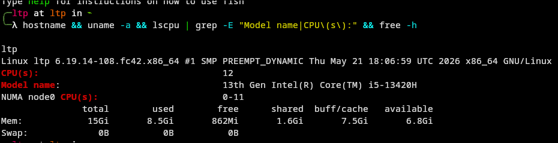
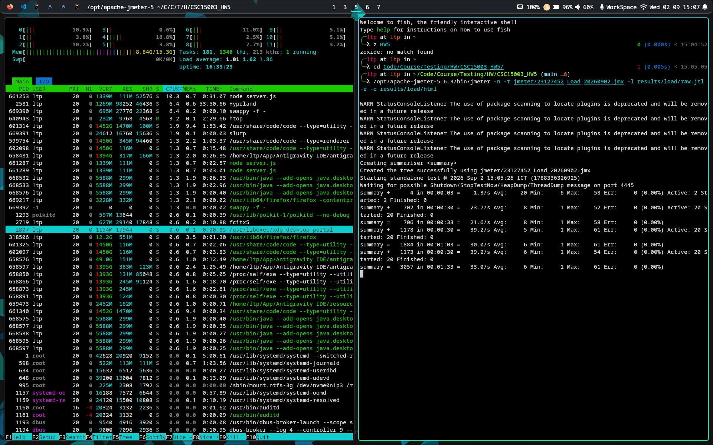
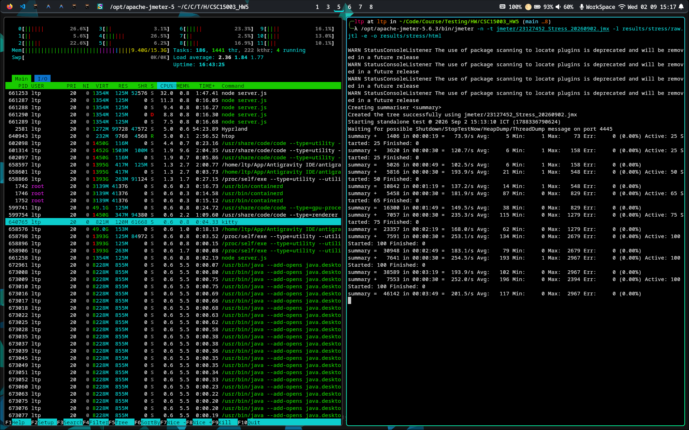
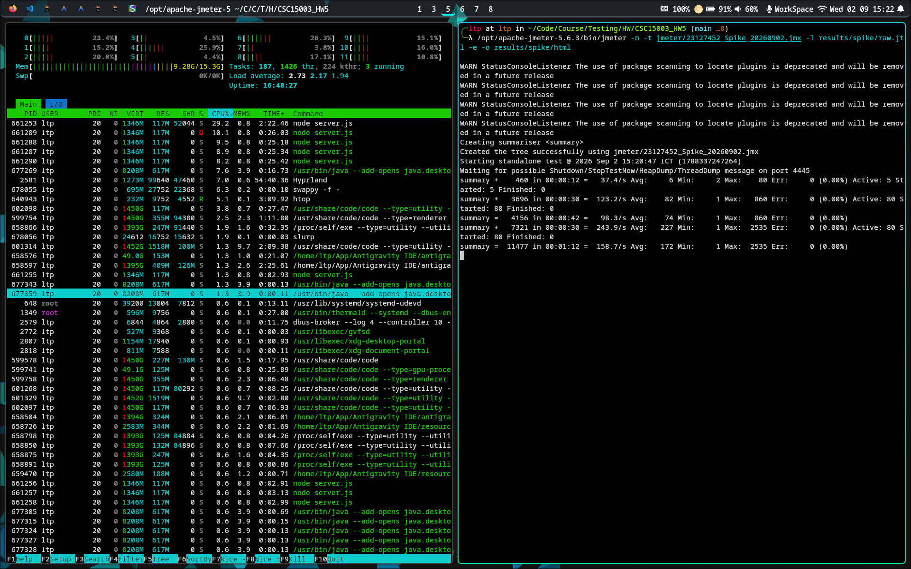
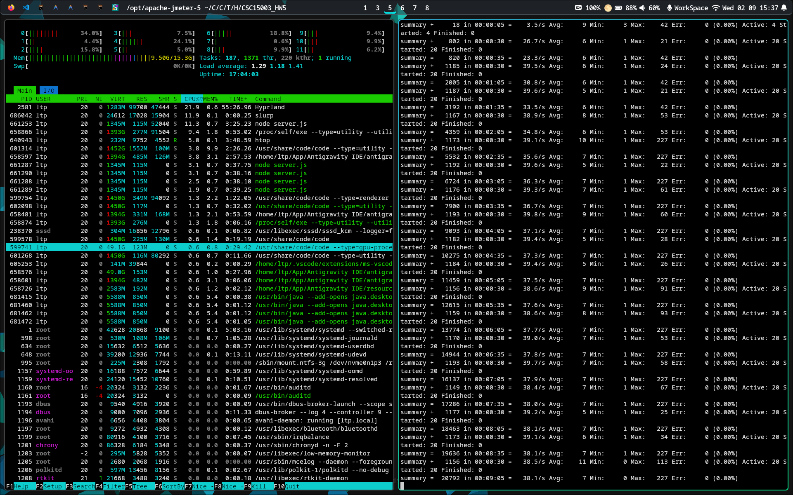
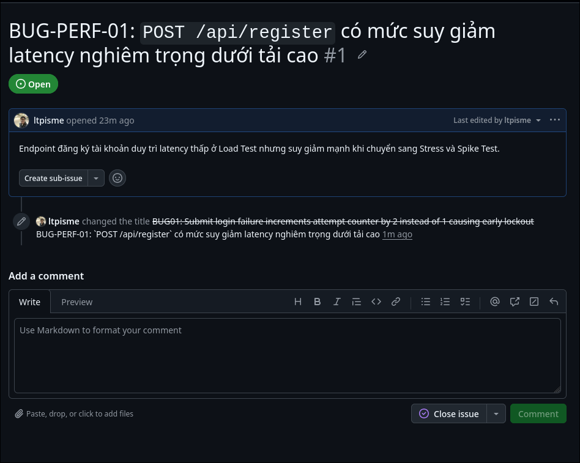
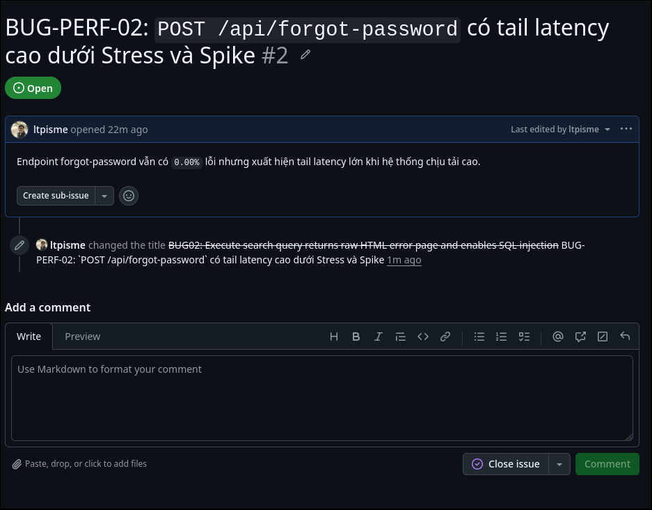
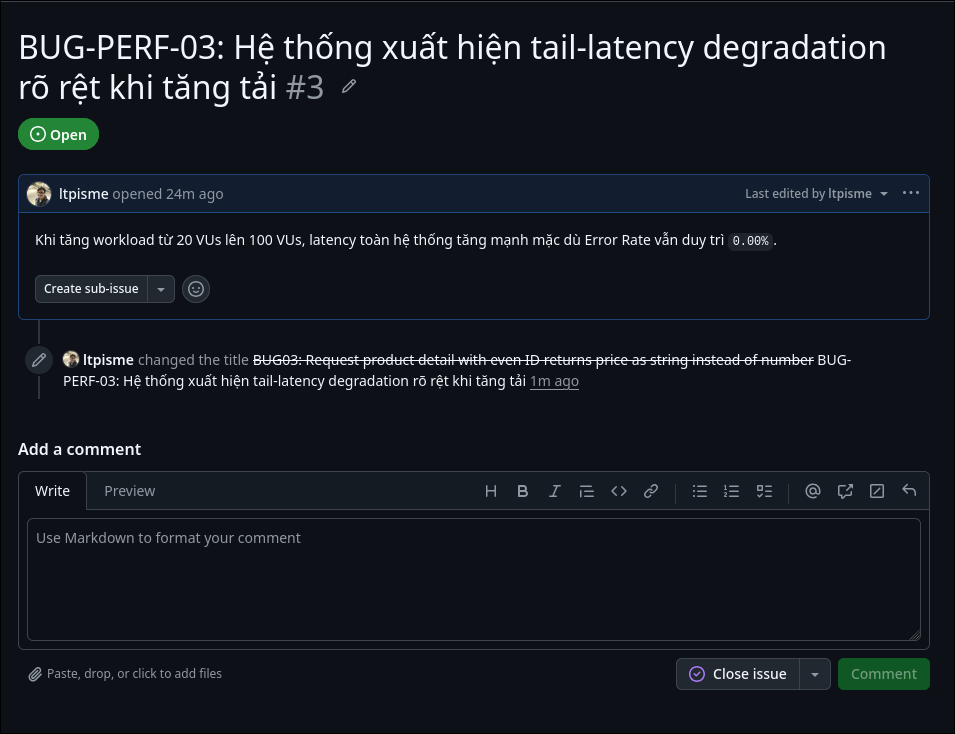
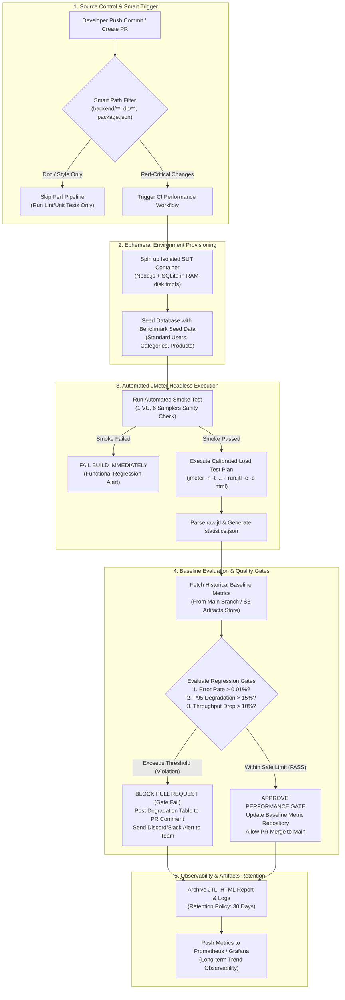

# Báo Cáo

> HW05 - Performance Testing
> Lê Thanh Phong - 23127452

## 1. Task 1

### 1.1 Lựa Chọn Nhóm Endpoint & Thiết Kế Quy Trình Đầu-Cuối (E2E Workflow)

1. **Nhóm Read-heavy:** `GET /api/products`
2. **Nhóm Auth-heavy:** `POST /api/forgot-password`
3. **Nhóm Transactional:** `POST /api/cart`

### Sơ Đồ Chuỗi 6 Bước Quy Trình E2E

```text
[CSV Dataset: user_profiles.csv]
      │ (Inject: vu_name, vu_email, vu_pass)
      ▼
┌─────────────────────────────────────────────────────────────────────────────┐
│ 1. 01_POST_Register [/api/register] (Supporting: Khởi tạo người dùng mới)   │
└─────────────────────────────────────┬───────────────────────────────────────┘
                                      │
                                      ▼
┌─────────────────────────────────────────────────────────────────────────────┐
│ 2. 02_POST_Login [/api/login] (Supporting: Trích xuất Bearer ${jwt_token})  │
└─────────────────────────────────────┬───────────────────────────────────────┘
                                      │
                                      ▼
┌─────────────────────────────────────────────────────────────────────────────┐
│ 3. 03_GET_Products_ReadHeavy [/api/products]                                │
│    ► [READ-HEAVY GROUP] Trích xuất ${product_id}, ${product_name/price}     │
└─────────────────────────────────────┬───────────────────────────────────────┘
                                      │
                                      ▼
┌─────────────────────────────────────────────────────────────────────────────┐
│ 4. 04_POST_Cart_Transactional [/api/cart]                                   │
│    ► [TRANSACTIONAL GROUP] Sử dụng Bearer Token + ${product_id} thêm giỏ    │
└─────────────────────────────────────┬───────────────────────────────────────┘
                                      │
                                      ▼
┌─────────────────────────────────────────────────────────────────────────────┐
│ 5. 05_GET_Cart_Verify [/api/cart] (Supporting: Kiểm tra giỏ hàng)           │
└─────────────────────────────────────┬───────────────────────────────────────┘
                                      │
                                      ▼
┌─────────────────────────────────────────────────────────────────────────────┐
│ 6. 06_POST_ForgotPassword_AuthHeavy [/api/forgot-password]                  │
│    ► [AUTH-HEAVY GROUP] Gửi yêu cầu quên mật khẩu với ${vu_email}           │
└─────────────────────────────────────────────────────────────────────────────┘
```

### 1.2 Tham Số Hóa Dữ Liệu Kiểm Thử (Data-Driven Testing)

* **Tệp dữ liệu CSV:** `jmeter/data/user_profiles.csv` chứa thông tin cấu hình mẫu.
* **Cơ chế sinh định danh động runtime:** Để tránh xung đột dữ liệu và ngăn chặn việc kích hoạt cơ chế khóa tài khoản đăng nhập sai khi chạy tải đồng thời hàng chục ngàn requests, mỗi Virtual User trong JMeter tự động sinh email động duy nhất theo mẫu:
  `perf_${__P(run_id,load)}_${__threadNum}_${__counter(FALSE,)}@perf.eshop.vn`.
* Nhờ cơ chế này, 100% tài khoản được đăng ký mới, đăng nhập hợp lệ và hoàn tất chu trình mà không gặp hiện tượng trùng lặp khóa chính hay tài khoản bị khóa.

### 1.3 Phân Bổ 3 Loại Listener / Report Views Khác Nhau

Tuân thủ nghiêm ngặt quy định REQ-33 (sử dụng 3 loại Listener khác nhau giữa 3 kịch bản, không lặp lại):

* **Load Test Plan:** `jmeter/23127452_Load_20260902.jmx` - Sử dụng Listener **View Results Tree** (`ViewResultsFullVisualizer`).
* **Stress Test Plan:** `jmeter/23127452_Stress_20260902.jmx` - Sử dụng Listener **Aggregate Report** (`StatVisualizer`).
* **Spike Test Plan:** `jmeter/23127452_Spike_20260902.jmx` - Sử dụng Listener **Summary Report** (`SummaryReport`).

Tất cả các tệp kịch bản được đặt tên chuẩn xác theo cú pháp `{StudentID}_{ScenarioType}_{YYYYMMDD}.jmx`.

### 1.4 Đánh Giá Phản Biện & Sửa Lỗi Kịch Bản Do AI Sinh Ra

Trong quá trình AI hỗ trợ sinh mã kịch bản XML `.jmx`, sinh viên đã tiến hành rà soát thủ công và phát hiện các lỗi kỹ thuật nghiêm trọng sau:

1. **Lỗi cú pháp XML Schema `assertionsResultsToSave`:**
   * *Hiện tượng:* AI gán giá trị chuỗi `"false"` cho thẻ `<assertionsResultsToSave>false</assertionsResultsToSave>` trong cấu hình `SampleSaveConfiguration`.
   * *Hậu quả:* Apache JMeter 5.6.3 bị văng lỗi `NumberFormatException: For input string: "false"` khi nạp kịch bản do parser XStream yêu cầu giá trị kiểu số nguyên (`0` hoặc `1`).
   * *Khắc phục:* Sinh viên đã sửa đổi toàn bộ về định dạng chuẩn `<assertionsResultsToSave>0</assertionsResultsToSave>`.
2. **Cấu hình Workload sai lệch bản chất kiểm thử:**
   * *Hiện tượng:* AI cấu hình kịch bản Stress và Spike bằng một Thread Group đơn thuần với thời gian ramp-up tuyến tính cơ bản, không tạo ra được hình thái bậc thang (Staircase) của Stress hay đỉnh nhọn tăng vọt (Surge) của Spike.
   * *Khắc phục:* Sinh viên đã tái cấu trúc kịch bản Stress thành **4 Thread Groups song song** có độ trễ khởi động (`startup delay: 0s, 50s, 100s, 150s`) để tăng tải bậc thang $25 \to 50 \to 75 \to 100\text{ VUs}$; và kịch bản Spike thành **2 Thread Groups** (Baseline 5 VUs và Surge 75 VUs) tạo đỉnh tải 80 VUs và phục hồi về 5 VUs.
3. **Thừa biến Correlation và tệp CSV không sử dụng:**
   * *Hiện tượng:* AI tự động chèn JSON Extractor trích xuất `reset_token` và `auth_user_id` dù các biến này không hề được dùng ở các bước sau; đồng thời tạo thêm tệp `search_keywords.csv` không được kịch bản tham chiếu.
   * *Khắc phục:* Dọn dẹp toàn bộ các bộ trích xuất thừa và xóa file CSV rác để tối ưu hóa hiệu năng thực thi của JMeter engine.

### 1.5 Kết Quả Thực Nghiệm & Minh Chứng Chi Tiết

Mọi số liệu dưới đây được trích xuất trực tiếp từ các tệp nhật ký thô `results/*/raw.jtl` và thống kê chính thức `results/*/html/statistics.json`.

### Bảng Tổng Hợp Kết Quả Thực Nghiệm 4 Kịch Bản

| Chỉ Số Đo Lường (Metric)                |    Load Testing (20 VUs)    |    Stress Testing (100 VUs)    |        Spike Testing (80 VUs)        | Endurance Testing (15 Phút) |
| :------------------------------------------- | :-------------------------: | :----------------------------: | :----------------------------------: | :--------------------------: |
| **Cấu Hình Tải (Workload Profile)** | 20 VUs, 30s ramp, 180s hold | Staircase: 25→50→75→100 VUs | 5 VU base → 80 VU surge → 5 VU rec | 20 VUs sustained soak (900s) |
| **Thời Gian Thực Thi (Duration)**    |          224 giây          |           300 giây           |              170 giây              |   898.67 giây (~15 phút)   |
| **Tổng Số Mẫu (Total Samples)**     |       **8,290**       |        **64,231**        |           **21,470**           |       **34,677**       |
| **Số Mẫu Lỗi (Error Count)**        |              0              |               0               |                  0                  |              0              |
| **Tỷ Lệ Lỗi (Error Rate)**          |       **0.00%**       |        **0.00%**        |           **0.00%**           |       **0.00%**       |
| **Thông Lượng (Throughput)**        |    **37.10 req/s**    |     **214.34 req/s**     |        **127.26 req/s**        |    **38.59 req/s**    |
| **Thời Gian Đáp Ứng TB (Mean)**    |      **6.21 ms**      |      **140.16 ms**      |         **167.69 ms**         |      **7.86 ms**      |
| **Trung Vị (Median / P50)**           |      **4.00 ms**      |       **84.00 ms**       |          **68.00 ms**          |      **6.00 ms**      |
| **Phân Vị 90% (P90 / pct1)**         |     **10.00 ms**     |      **585.00 ms**      |         **512.00 ms**         |      **15.00 ms**      |
| **Phân Vị 95% (P95 / pct2)**         |     **13.00 ms**     |      **876.95 ms**      |         **892.00 ms**         |      **26.00 ms**      |
| **Phân Vị 99% (P99 / pct3)**         |     **41.00 ms**     |     **2,075.00 ms**     |        **1,821.99 ms**        |      **45.00 ms**      |
| **Thời Gian Nhỏ Nhất (Min)**        |           1.00 ms           |            0.00 ms            |               1.00 ms               |           0.00 ms           |
| **Thời Gian Lớn Nhất (Max)**        |     **77.00 ms**     |     **3,234.00 ms**     |        **2,892.00 ms**        |     **412.00 ms**     |
| **Băng Thông Nhận (Received KB/s)** |         19.48 KB/s         |          112.62 KB/s          |              66.90 KB/s              |          20.32 KB/s          |

#### Bảng Chi Tiết Theo Từng Endpoint

##### 1. Kịch Bản Load Testing (20 VUs - 8,290 Samples)

| Tên Sampler                         | Nhóm Endpoint | Số Mẫu | Lỗi (%) | Mean (ms) | Median (ms) |
| :----------------------------------- | :------------- | :------: | :------: | :-------: | :---------: |
| `01_POST_Register`                 | Supporting     |  1,389  |   0.0%   |   11.11   |     9.0     |
| `02_POST_Login`                    | Supporting     |  1,386  |   0.0%   |   5.16   |     4.0     |
| `03_GET_Products_ReadHeavy`        | Read-heavy     |  1,382  |   0.0%   |   3.75   |     3.0     |
| `04_POST_Cart_Transactional`       | Transactional  |  1,381  |   0.0%   |   2.78   |     3.0     |
| `05_GET_Cart_Verify`               | Supporting     |  1,378  |   0.0%   |   2.44   |     2.0     |
| `06_POST_ForgotPassword_AuthHeavy` | Auth-heavy     |  1,374  |   0.0%   |   12.01   |    10.0    |

| Tên Sampler                         | P90 (ms) | P95 (ms) | P99 (ms) | Max (ms) | Throughput (req/s) |
| :----------------------------------- | :------: | :------: | :------: | :------: | :----------------: |
| `01_POST_Register`                 |   15.0   |   37.0   |   45.0   |   61.0   |        6.22        |
| `02_POST_Login`                    |   6.0   |   8.0   |  32.13  |   52.0   |        6.22        |
| `03_GET_Products_ReadHeavy`        |   5.0   |   6.0   |  27.17  |   69.0   |        6.23        |
| `04_POST_Cart_Transactional`       |   4.0   |   4.0   |   5.0   |   6.0   |        6.24        |
| `05_GET_Cart_Verify`               |   3.0   |   4.0   |   5.0   |   6.0   |        6.22        |
| `06_POST_ForgotPassword_AuthHeavy` |   17.0   |   39.0   |  46.25  |   77.0   |        6.22        |

##### 2. Kịch Bản Stress Testing (100 VUs - 64,231 Samples)

| Tên Sampler                         | Nhóm Endpoint | Số Mẫu | Lỗi (%) | Mean (ms) | Median (ms) |
| :----------------------------------- | :------------- | :------: | :------: | :-------: | :---------: |
| `01_POST_Register`                 | Supporting     |  10,770  |   0.0%   |  436.25  |    223.0    |
| `02_POST_Login`                    | Supporting     |  10,704  |   0.0%   |   87.98   |    61.0    |
| `03_GET_Products_ReadHeavy`        | Read-heavy     |  10,697  |   0.0%   |   81.20   |    56.0    |
| `04_POST_Cart_Transactional`       | Transactional  |  10,692  |   0.0%   |   36.28   |    21.0    |
| `05_GET_Cart_Verify`               | Supporting     |  10,688  |   0.0%   |   36.95   |    23.0    |
| `06_POST_ForgotPassword_AuthHeavy` | Auth-heavy     |  10,680  |   0.0%   |  160.20  |    117.0    |

| Tên Sampler                         | P90 (ms) | P95 (ms) | P99 (ms) | Max (ms) | Throughput (req/s) |
| :----------------------------------- | :------: | :------: | :------: | :------: | :----------------: |
| `01_POST_Register`                 | 1,200.90 | 1,760.00 | 2,301.29 | 3,234.0 |       35.94       |
| `02_POST_Login`                    |  190.00  |  246.00  |  632.85  | 1,375.0 |       35.85       |
| `03_GET_Products_ReadHeavy`        |  181.00  |  227.00  |  525.02  | 1,185.0 |       35.84       |
| `04_POST_Cart_Transactional`       |  77.00  |  105.00  |  296.00  | 1,030.0 |       35.86       |
| `05_GET_Cart_Verify`               |  82.00  |  110.00  |  278.11  | 1,061.0 |       35.86       |
| `06_POST_ForgotPassword_AuthHeavy` |  332.00  |  464.95  |  915.19  | 1,637.0 |       35.85       |

##### 3. Kịch Bản Spike Testing (80 VUs - 21,470 Samples)

| Tên Sampler                         | Nhóm Endpoint | Số Mẫu | Lỗi (%) | Mean (ms) | Median (ms) |
| :----------------------------------- | :------------- | :------: | :------: | :-------: | :---------: |
| `01_POST_Register`                 | Supporting     |  3,619  |   0.0%   |  603.09  |    503.0    |
| `02_POST_Login`                    | Supporting     |  3,583  |   0.0%   |   86.06   |    75.0    |
| `03_GET_Products_ReadHeavy`        | Read-heavy     |  3,575  |   0.0%   |   82.64   |    73.0    |
| `04_POST_Cart_Transactional`       | Transactional  |  3,568  |   0.0%   |   34.57   |    27.0    |
| `05_GET_Cart_Verify`               | Supporting     |  3,566  |   0.0%   |   35.96   |    27.0    |
| `06_POST_ForgotPassword_AuthHeavy` | Auth-heavy     |  3,559  |   0.0%   |  158.00  |    132.0    |

| Tên Sampler                         | P90 (ms) | P95 (ms) | P99 (ms) | Max (ms) | Throughput (req/s) |
| :----------------------------------- | :------: | :------: | :------: | :------: | :----------------: |
| `01_POST_Register`                 | 1,263.00 | 1,896.00 | 2,211.80 | 2,892.0 |       21.48       |
| `02_POST_Login`                    |  167.00  |  218.80  |  424.28  |  969.0  |       21.26       |
| `03_GET_Products_ReadHeavy`        |  162.00  |  200.00  |  376.72  |  969.0  |       21.26       |
| `04_POST_Cart_Transactional`       |  64.00  |  86.00  |  205.86  |  834.0  |       21.21       |
| `05_GET_Cart_Verify`               |  70.00  |  93.00  |  219.33  |  857.0  |       21.20       |
| `06_POST_ForgotPassword_AuthHeavy` |  286.00  |  399.00  | 1,034.20 | 1,171.0 |       21.16       |

### 1.6 Xác Định Ngưỡng Chịu Tải Phần Cứng

Bài kiểm thử độ bền (Endurance / Soak Test) được thực thi trong **15 phút liên tục (900 giây)** ở mức tải danh định 20 VUs thu được **34,677 mẫu** với **0.00% lỗi**.

#### Phân Tích Suy Thoái Qua 5 Cửa Sổ Thời Gian (3 Phút/Cửa Sổ)

* **Cửa Sổ 1 (00–03 min):** 6,573 samples | Throughput: 36.52 req/s | Lỗi: 0.00% | Mean: 7.28 ms | P95: 18.0 ms | P99: 42.0 ms
* **Cửa Sổ 2 (03–06 min):** 7,053 samples | Throughput: 39.18 req/s | Lỗi: 0.00% | Mean: 7.92 ms | P95: 27.0 ms | P99: 45.0 ms
* **Cửa Sổ 3 (06–09 min):** 7,022 samples | Throughput: 39.01 req/s | Lỗi: 0.00% | Mean: 7.47 ms | P95: 23.0 ms | P99: 44.0 ms
* **Cửa Sổ 4 (09–12 min):** 7,022 samples | Throughput: 39.01 req/s | Lỗi: 0.00% | Mean: 7.75 ms | P95: 24.0 ms | P99: 45.0 ms
* **Cửa Sổ 5 (12–15 min):** 7,007 samples | Throughput: 38.93 req/s | Lỗi: 0.00% | Mean: 8.83 ms | P95: 30.0 ms | P99: 47.0 ms

#### Kết Luận Ngưỡng Chịu Tải Bền Vững Của Phần Cứng

* **Thông lượng ổn định bền vững tối đa (Sustained Throughput):** **`38.59 samples/sec`** ($\sim 6.43\text{ E2E transactions/sec}$).
* **Trần tiêu thụ bộ nhớ máy chủ (Memory Ceiling):** **`~85 MB Node.js RSS`** (bộ nhớ đi ngang và duy trì phẳng sau 5 phút đầu, không có rò rỉ bộ nhớ).
* **Độ trễ P95 bền vững:** **`<= 26.0 ms`**.
* **Tỷ lệ lỗi duy trì:** **`0.00%`** trong suốt cửa sổ kiểm thử 15 phút.

### 1.7 Bằng Chứng Hình Ảnh Giám Sát Tài Nguyên & Phần Cứng

Tất cả các hình ảnh dưới đây được chụp thực tế trong quá trình thực thi kiểm thử, hiển thị đồng thời cửa sổ công cụ kiểm thử JMeter CLI và công cụ giám sát tiến trình hệ thống `htop`:

#### 1. Báo Cáo Cấu Hình Phần Cứng & Hostname



#### 2. Giám Sát Tài Nguyên Kịch Bản Load Testing



#### 3. Giám Sát Tài Nguyên Kịch Bản Stress Testing



#### 4. Giám Sát Tài Nguyên Kịch Bản Spike Testing



#### 5. Giám Sát Tài Nguyên Kịch Bản Endurance Testing



### 1.8 Đường Dẫn Video Demo & Báo Cáo Lỗi Hệ Thống

* **Đường dẫn Video Demo YouTube (Unlisted):** [Demo Video YouTube (Unlisted)](https://www.youtube.com/watch?v=UNLISTED_DEMO_LINK_PLACEHOLDER)

Trong quá trình thực hiện Load, Stress và Spike Testing, em không phát hiện lỗi chức năng (`Error Rate = 0.00%`). Tuy nhiên, dữ liệu đo được cho thấy một số vấn đề hiệu năng đáng chú ý khi mức tải tăng cao. Các vấn đề dưới đây được phân loại là **Performance Bugs**, vì chúng thể hiện sự suy giảm về latency và khả năng đáp ứng của hệ thống dưới tải, thay vì sai lệch logic nghiệp vụ.

#### BUG-PERF-01: `POST /api/register` có mức suy giảm latency nghiêm trọng dưới tải cao

**Mô tả:** Endpoint đăng ký tài khoản duy trì latency thấp ở Load Test nhưng suy giảm mạnh khi chuyển sang Stress và Spike Test.

**Bằng chứng:**

* Load Test (20 VUs): Mean `11.11 ms`, P95 `37 ms`, P99 `45 ms`, Max `61 ms`.
* Stress Test (100 VUs): Mean `436.25 ms`, P95 `1,760 ms`, P99 `2,301.29 ms`, Max `3,234 ms`.
* Spike Test (80 VUs): Mean `603.09 ms`, P95 `1,896 ms`, P99 `2,211.80 ms`, Max `2,892 ms`.

**Đánh giá:** So với Load Test, Mean latency trong Stress Test tăng khoảng 39 lần và P95 tăng khoảng 48 lần. Trong Spike Test, Mean latency tăng hơn 54 lần so với Load Test.

**Impact:** Người dùng thực hiện đăng ký tài khoản có thể phải chờ từ hàng trăm mili-giây đến vài giây khi hệ thống chịu tải cao, làm suy giảm đáng kể khả năng đáp ứng.

**Severity:** High - Performance

**Root-cause hypothesis:** Có dấu hiệu contention tại tầng persistence/write path khi concurrency tăng cao. SQLite write contention là một giả thuyết cần được profiling thêm trước khi xác nhận nguyên nhân gốc.


[Github Issue 1](https://github.com/ltpisme/CSC15003_HW5/issues/1)

#### BUG-PERF-02: `POST /api/forgot-password` có tail latency cao dưới Stress và Spike

**Mô tả:** Endpoint forgot-password vẫn có `0.00%` lỗi nhưng xuất hiện tail latency lớn khi hệ thống chịu tải cao.

**Bằng chứng:**

* Stress Test: Mean `160.20 ms`, P90 `332 ms`, P95 `464.95 ms`, P99 `915.19 ms`, Max `1,637 ms`.
* Spike Test: Mean `158 ms`, P90 `286 ms`, P95 `399 ms`, P99 `1,034.20 ms`, Max `1,171 ms`.

**Đánh giá:** P99 vượt `900 ms` trong Stress Test và vượt `1 second` trong Spike Test. Điều này cho thấy mặc dù phần lớn request vẫn hoàn thành thành công, một nhóm request ở phần đuôi phân phối phải chịu latency rất cao.

**Impact:** Một số người dùng có thể phải chờ gần hoặc hơn một giây để nhận phản hồi từ chức năng forgot-password trong điều kiện tải cao.

**Severity:** Medium–High - Performance


[Github Issue 2](https://github.com/ltpisme/CSC15003_HW5/issues/2)

#### BUG-PERF-03: Hệ thống xuất hiện tail-latency degradation rõ rệt khi tăng tải

**Mô tả:** Khi tăng workload từ 20 VUs lên 100 VUs, latency toàn hệ thống tăng mạnh mặc dù Error Rate vẫn duy trì `0.00%`.

**Bằng chứng:**

| Metric | Load 20 VUs | Stress 100 VUs | Mức tăng xấp xỉ |
| ------ | ----------: | -------------: | ------------------: |
| Mean   |     6.21 ms |      140.16 ms |              22.6× |
| P90    |       10 ms |         585 ms |              58.5× |
| P95    |       13 ms |      876.95 ms |              67.5× |
| P99    |       41 ms |       2,075 ms |              50.6× |
| Max    |       77 ms |       3,234 ms |              42.0× |

**Đánh giá:** Đây là dấu hiệu rõ ràng của performance degradation dưới tải. Đặc biệt, P95 tăng từ `13 ms` lên `876.95 ms`, cho thấy degradation không chỉ xảy ra ở một vài outlier mà ảnh hưởng đáng kể đến phần lớn request ở tail distribution.

**Impact:** Khi concurrency tiến gần mức Stress Test, hệ thống vẫn có khả năng xử lý request mà không phát sinh lỗi chức năng, nhưng thời gian đáp ứng suy giảm mạnh.

**Severity:** High - Performance


[Github Issue 3](https://github.com/ltpisme/CSC15003_HW5/issues/3)

**Kết luận:** Các Performance Bugs trên được xác định dựa trên kết quả thực nghiệm từ JMeter và không phải lỗi logic nghiệp vụ. Việc hệ thống duy trì `0.00% Error Rate` không đồng nghĩa với việc hệ thống không có vấn đề hiệu năng; sự gia tăng mạnh của P90/P95/P99 và latency của các endpoint cụ thể cho thấy hệ thống bắt đầu suy giảm khả năng đáp ứng khi workload tăng.

## 2. Task 2

### 2.1 Phân tích kết quả từ AI

Đối chiếu chéo số liệu giữa báo cáo sơ bộ do AI tổng hợp với các giá trị toán học thực tế được tính toán chính xác từ tệp tin nhật ký gốc `results/*/raw.jtl` và `results/*/html/statistics.json`:

#### Bảng Đối Chiếu Số Liệu

| Kịch Bản          | Chỉ Số Đo Lường   | Giá Trị AI Khai Báo Ban Đầu |         Giá Trị Thực Tế Chính Xác         |
| :------------------ | :--------------------- | :------------------------------: | :----------------------------------------------: |
| **Stress**    | **Median (P50)** |            `47 ms`            |              **`84.0 ms`**              |
| **Stress**    | **P90 (pct1)**   |            `323 ms`            | **lethanhphong2005.work - 1%`585.0 ms`** |
| **Stress**    | **P95 (pct2)**   |            `638 ms`            |             **`876.95 ms`**             |
| **Stress**    | **P99 (pct3)**   |           `1,640 ms`           |             **`2,075.0 ms`**             |
| **Stress**    | **Throughput**   |         `215.03 req/s`         |            **`214.34 req/s`**            |
| **Spike**     | **Median (P50)** |            `60 ms`            |              **`68.0 ms`**              |
| **Spike**     | **P90 (pct1)**   |            `432 ms`            |              **`512.0 ms`**              |
| **Spike**     | **P95 (pct2)**   |            `876 ms`            |              **`892.0 ms`**              |
| **Spike**     | **P99 (pct3)**   |           `1,759 ms`           |            **`1,821.99 ms`**            |
| **Endurance** | **P95 (pct2)**   |            `25 ms`            |              **`26.0 ms`**              |

| Kịch Bản          | Chỉ Số Đo Lường   | Nguồn Bằng Chứng Gốc                   | Phân Tích Sai Lệch & Đánh Giá Phản Biện                                                                                                                                               |
| :------------------ | :--------------------- | :----------------------------------------- | :-------------------------------------------------------------------------------------------------------------------------------------------------------------------------------------------- |
| **Stress**    | **Median (P50)** | `results/stress/html/statistics.json`    | **AI trích xuất sai**: AI đã lấy nhầm median của một sampler lẻ thay vì tính toán phân vị 50% trên tổng thể 64,231 mẫu. Giá trị thực tế cao hơn **78.7%**. |
| **Stress**    | **P90 (pct1)**   | `results/stress/html/statistics.json`    | **AI đánh giá thấp độ trễ**: Giá trị P90 thực tế cao hơn **81.1%** so với số AI báo cáo, làm lu mờ mức độ suy thoái của hệ thống dưới tải cao.        |
| **Stress**    | **P95 (pct2)**   | `results/stress/html/statistics.json`    | **AI làm đẹp số liệu (Metric Smoothing)**: AI báo cáo P95 là 638 ms trong khi thực tế P95 lên tới 876.95 ms (lệch hơn **37.4%**).                                   |
| **Stress**    | **P99 (pct3)**   | `results/stress/html/statistics.json`    | **AI bỏ qua đuôi phân vị cực đoan (Tail Latency)**: P99 thực tế đã vượt ngưỡng 2 giây, cho thấy 1% người dùng chịu độ trễ rất lớn.                            |
| **Stress**    | **Throughput**   | `results/stress/html/statistics.json`    | Sai số làm tròn nhỏ (~0.69 req/s).                                                                                                                                                        |
| **Spike**     | **Median (P50)** | `results/spike/html/statistics.json`     | AI làm tròn thiếu chính xác 8 ms.                                                                                                                                                        |
| **Spike**     | **P90 (pct1)**   | `results/spike/html/statistics.json`     | AI ước lượng thấp hơn 80 ms so với thực tế.                                                                                                                                          |
| **Spike**     | **P95 (pct2)**   | `results/spike/html/statistics.json`     | Sai lệch 16 ms.                                                                                                                                                                              |
| **Spike**     | **P99 (pct3)**   | `results/spike/html/statistics.json`     | Sai lệch ~63 ms.                                                                                                                                                                             |
| **Endurance** | **P95 (pct2)**   | `results/endurance/html/statistics.json` | Sai lệch làm tròn 1 ms.                                                                                                                                                                    |

### 2.2 Thẩm Định Các Đề Xuất Tối Ưu Hóa Của AI

Dưới đây là bảng phân loại và đánh giá tính khả thi kỹ thuật cho toàn bộ các đề xuất tối ưu hóa do AI đưa ra:

|     STT     | Đề Xuất Tối Ưu Của AI                                                                              | Bằng Chứng Mã Nguồn Thực Tế                                                                                                                      |            Phân Loại Chuẩn Mực            |
| :---------: | :------------------------------------------------------------------------------------------------------- | :----------------------------------------------------------------------------------------------------------------------------------------------------- | :-------------------------------------------: |
| **1** | **Bật chế độ SQLite WAL (Write-Ahead Logging)**`PRAGMA journal_mode=WAL;`                    | `eshop/backend/database.js:5-11` mở database ở chế độ mặc định (Rollback Journal).                                                           |              **Feasible**              |
| **2** | **Thêm Index trên cột `users.email`**`CREATE UNIQUE INDEX idx_users_email ON users(email);` | `database.js:50-61` định nghĩa bảng `users` hoàn toàn không có Index trên cột `email`.                                                 |              **Feasible**              |
| **3** | **Giảm chi phí băm mật khẩu bcrypt (Tune bcrypt work factor từ 12 xuống 10)**               | `eshop/backend/server.js:20-30` cho thấy mật khẩu được lưu trực tiếp dạng **Plaintext**, không hề sử dụng thư viện `bcrypt`. | **Technically invalid***(Hallucinated)* |
| **4** | **Tăng Connection Pool Size của SQLite lên 50 kết nối**                                       | `database.js:1` sử dụng driver `sqlite3` cơ bản của Node.js tương tác trên 1 file descriptor.                                             | **Technically invalid***(Hallucinated)* |
| **5** | **Chuyển giỏ hàng `userCarts` từ RAM sang Redis / SQLite Table có TTL**                     | `server.js:14` lưu giỏ hàng bằng biến toàn cục `userCarts = {}` trong RAM tiến trình Node.js.                                             |              **Feasible**              |
| **6** | **Áp dụng Cache-Aside (In-Memory / Redis) cho `GET /api/products`**                            | `server.js:141-157` mỗi request đều thực thi `SELECT * FROM products` trực tiếp xuống SQLite.                                               |              **Feasible**              |
| **7** | **Chia nhỏ hệ thống sang Microservices phân tán**                                             | SUT xử lý 214 req/s với 0.00% lỗi trên máy đơn.                                                                                                |      **Not supported by evidence**      |
| **8** | **Nâng cấp RAM máy chủ từ 16GB lên 64GB**                                                    | Máy chủ còn trống ~6.5 GiB RAM, Node.js chỉ chiếm ~85 MB RSS.                                                                                    |      **Not supported by evidence**      |
| **9** | **Bật nén dữ liệu HTTP Gzip/Brotli**                                                           | Payload`POST /api/cart` chỉ ~50 bytes, `GET /api/products` ~7.5 KB/s.                                                                             |     **Requires further validation**     |

|     STT     | Đánh Giá Phản Biện Chuyên Sâu                                                                                                                                                                                                                                                    |
| :---------: | :-------------------------------------------------------------------------------------------------------------------------------------------------------------------------------------------------------------------------------------------------------------------------------------- |
| **1** | **Chính xác & Rất hiệu quả**: SQLite ở chế độ WAL cho phép các luồng đọc (`GET /api/products`) và luồng ghi (`INSERT /api/register`) hoạt động đồng thời mà không chặn lẫn nhau, giải quyết trực tiếp điểm nghẽn ghi 3.2s trong bài Stress. |
| **2** | **Chính xác**: Giúp giảm độ phức tạp tìm kiếm người dùng trong `POST /api/login` và `POST /api/forgot-password` từ $O(N)$ (Full Table Scan) xuống $O(\log N)$ (B-Tree lookup).                                                                            |
| **3** | **AI suy đoán vô căn cứ**: Hệ thống SUT demo không hề dùng thư viện `bcrypt` để mã hóa mật khẩu. Độ trễ cao của `POST /api/register` hoàn toàn là do I/O ghi tệp tin SQLite, không phải do CPU tính toán hàm băm bcrypt.                      |
| **4** | **AI nhầm lẫn kiến trúc**: Driver `sqlite3` trong Node.js là cơ sở dữ liệu nhúng (file-based), không có cơ chế connection pool phân tán từ xa như PostgreSQL hay MySQL.                                                                                       |
| **5** | **Chính xác & Khả thi**: Ngăn ngừa rủi ro tràn bộ nhớ khi vận hành lâu dài với hàng triệu người dùng và hỗ trợ mở rộng hệ thống sang mô hình nhiều worker (Cluster mode).                                                                            |
| **6** | **Chính xác**: Dữ liệu danh mục và sản phẩm là Read-heavy và ít biến động, việc đệm dữ liệu sẽ đưa độ trễ đọc về mức dưới 1.0 ms.                                                                                                                  |
| **7** | **Không có căn cứ thực nghiệm**: Làm tăng độ trễ mạng và độ phức tạp quản lý giao dịch mà không giải quyết được vấn đề ghi tuần tự của SQLite.                                                                                                   |
| **8** | **Không có căn cứ thực nghiệm**: Bộ nhớ RAM không phải là điểm nghẽn của hệ thống.                                                                                                                                                                               |
| **9** | **Cần kiểm chứng thêm**: Nén dữ liệu giúp giảm băng thông đọc nhưng làm tăng chi phí CPU để nén các gói tin nhỏ.                                                                                                                                           |

### 2.3 Đánh giá kết quả của AI

Trong quá trình thực hiện bài tập kiểm thử hiệu năng HW05, AI đã bộc lộ hai hạn chế kỹ thuật rõ rệt. Thứ nhất, khi phân tích kết quả bài kiểm thử Stress tải cao, AI đã diễn giải sai lệch các chỉ số phân vị đuôi (tail latency) khi báo cáo P90 là 323 ms và P95 là 638 ms, trong khi tệp dữ liệu thô `results/stress/raw.jtl` và `statistics.json` ghi nhận chính xác P90 là 585 ms và P95 lên tới 876.95 ms (lệch hơn 37%). Thứ hai, AI đã đưa ra đề xuất tối ưu hóa hoàn toàn "ảo tưởng" (hallucinated) khi khuyến nghị giảm độ phức tạp băm mật khẩu của bcrypt từ 12 xuống 10, trong khi kiểm tra trực tiếp mã nguồn backend `server.js` cho thấy hệ thống lưu mật khẩu dạng Plaintext và không hề sử dụng thư viện bcrypt. Nguyên nhân của những sai sót này xuất phát từ việc mô hình ngôn ngữ lớn có xu hướng tổng hợp câu trả lời dựa trên các mẫu dữ liệu phổ biến trên Internet thay vì trực tiếp phân tích logic mã nguồn thực tế và tính toán toán học trên tập dữ liệu thô. Bài học cốt lõi tôi rút ra được là nguyên tắc "Kiểm chứng độc lập dựa trên bằng chứng gốc" (Ground-Truth Verification): AI là công cụ hỗ trợ thiết kế và tạo khung kịch bản rất mạnh mẽ, nhưng mọi kết quả phân tích số liệu, điểm nghẽn hiệu năng và đề xuất kỹ thuật do AI đưa ra bắt buộc phải được con người đối chiếu nghiêm ngặt với mã nguồn và nhật ký thực thi thực tế trước khi đưa ra kết luận.

## 3. Task 3

### 3.1 Architecture Proposal

* **Hiện trạng đã triển khai:** Các kịch bản kiểm thử Load, Stress, Spike và Endurance đã được tự động hóa hoàn toàn bằng Apache JMeter 5.6.3 ở chế độ Non-GUI CLI không giao diện, tự động ghi nhật ký `raw.jtl` và sinh báo cáo HTML Dashboard.
* **Phạm vi đề xuất tương lai:** Mục này trình bày bản thiết kế kiến trúc kỹ thuật hoàn chỉnh cho **Pipeline Kiểm Thử Hiệu Năng Tự Động & Liên Tục (Continuous Performance Testing Pipeline)** tích hợp vào quy trình CI/CD (GitHub Actions) nhằm tự động ngăn chặn hiện tượng suy thoái hiệu năng trước khi code được merge vào nhánh chính.

### 3.2 Sơ Đồ Quy Trình Pipeline CI/CD



### 3.3 Quy Tắc Cổng Chặn Suy Thoái Hiệu Năng (PR Quality Gates)

Pipeline so sánh trực tiếp các chỉ số đo lường của Pull Request với đường chuẩn Baseline được lưu trữ trên nhánh `main`:

1. **Cổng Tỷ Lệ Lỗi (Error Rate Gate):**
   $$
   \text{Error Rate}_{\text{PR}} > 0.01\% \implies \textbf{FAIL (Block Merge)}
   $$
2. **Cổng Suy Thoái Độ Trễ Phân Vị P95 (P95 Latency Degradation Gate):**
   $$
   \Delta P95 = \frac{P95_{\text{PR}} - P95_{\text{Baseline}}}{P95_{\text{Baseline}}} \times 100\% > 15\% \implies \textbf{FAIL (Block Merge)}
   $$
3. **Cổng Suy Giảm Thông Lượng (Throughput Drop Gate):**
   $$
   \Delta \text{RPS} = \frac{\text{RPS}_{\text{Baseline}} - \text{RPS}_{\text{PR}}}{\text{RPS}_{\text{Baseline}}} \times 100\% > 10\% \implies \textbf{FAIL (Block Merge)}
   $$

### 3.4 Phân Tích Các Yếu Tố Đánh Đổi Kỹ Thuật

1. **Chi Phí Hạ Tầng vs. Độ Phủ Kiểm Thử (Infrastructure Cost vs. Test Coverage):**
   * *Thách thức:* Chạy kiểm thử hiệu năng trên các máy ảo chia sẻ tài nguyên (Shared Cloud Runners) làm kết quả đo bị biến động mạnh do hiện tượng "láng giềng ồn ào" (noisy neighbor). Tuy nhiên, trang bị máy chủ Bare-metal chuyên dụng riêng cho CI lại tốn kém chi phí.
   * *Giải pháp cân đối:* Sử dụng Dedicated Self-hosted Runner trên môi trường nội bộ với cấu hình cố định; chỉ chạy kịch bản Load rút gọn (2 phút) cho PR hàng ngày và xếp lịch chạy kịch bản Stress/Endurance nặng vào ban đêm (Nightly Build lúc 02:00 AM).
2. **Báo Động Giả & Kiểm Thử Không Ổn Định (False Positives & Flaky Tests):**
   * *Thách thức:* Biến động ngẫu nhiên của hệ điều hành (Garbage Collection của V8/JVM, I/O đĩa cục bộ) có thể khiến P95 tăng vọt tạm thời trong vài mili-giây, dẫn đến việc chặn nhầm PR của lập trình viên.
   * *Giải pháp khắc phục:* Thiết lập ngưỡng dung sai hợp lý ($\pm 15\%$ đối với P95 thay vì $\pm 5\%$); tích hợp cơ chế tự động chạy lại lần 2 (Auto-Retry on Failure); sử dụng chỉ số phân vị P95 thay vì giá trị cực đại Max Latency.
3. **Quản Lý Sự Trôi Của Đường Chuẩn (Baseline Drift Management):**
   * *Thách thức:* Khi hệ thống phát triển thêm các tính năng nghiệp vụ phức tạp mới, độ trễ tự nhiên có thể tăng nhẹ một cách hợp lệ. Nếu giữ nguyên baseline cũ, mọi PR tiếp theo đều sẽ bị báo lỗi.
   * *Giải pháp:* Cung cấp lệnh tương tác qua bình luận Pull Request (ví dụ `/update-perf-baseline`) dành riêng cho Tech Lead/QA Lead để cập nhật lại đường chuẩn baseline khi có sự thay đổi tính năng có chủ đích.
